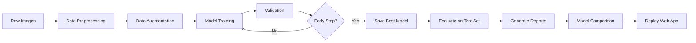

# 🧠 Brain Tumor MRI Image Classification - Project Complete!

## ✅ Project Status: COMPLETE

All components have been successfully created and are ready to use!

---

## 📂 Project Structure

```
Brain Tumor MRI Image Classification/
│
├── 📁 data/                          # Dataset directory
│   ├── train/                        # Training images (by class)
│   ├── validation/                   # Validation images (by class)
│   └── test/                         # Test images (by class)
│
├── 📁 models/                        # Trained models saved here
│   ├── custom_cnn_best.h5
│   ├── resnet50_best.h5
│   ├── mobilenet_best.h5
│   ├── inceptionv3_best.h5
│   └── efficientnetb0_best.h5
│
├── 📁 notebooks/                     # Jupyter notebooks
│   ├── 01_data_exploration.ipynb     # Dataset analysis & visualization
│   └── 02_model_training.ipynb       # Complete training pipeline
│
├── 📁 scripts/                       # Python scripts
│   ├── data_preprocessing.py         # Data loading & augmentation
│   ├── custom_cnn.py                 # Custom CNN architecture
│   ├── transfer_learning.py          # Pretrained models (ResNet, MobileNet, etc.)
│   ├── train.py                      # Training script (CLI)
│   ├── train_all_models.py           # Train all models sequentially
│   ├── evaluate.py                   # Model evaluation & comparison
│   └── utils.py                      # Utility functions
│
├── 📁 app/                           # Web application
│   └── streamlit_app.py              # Interactive Streamlit app
│
├── 📁 results/                       # Results & visualizations
│   ├── logs/                         # Training logs & TensorBoard
│   ├── *.png                         # Plots & visualizations
│   ├── *.csv                         # Metrics & comparisons
│   └── *.json                        # Configuration & results
│
├── 📄 README.md                      # Main documentation
├── 📄 QUICKSTART.md                  # Quick start guide
├── 📄 requirements.txt               # Python dependencies
└── 📄 .gitignore                     # Git ignore rules
```

---

## 🎯 What Has Been Built

### ✅ 1. Data Processing Pipeline
- **File**: `scripts/data_preprocessing.py`
- **Features**:
  - Image loading & normalization
  - Data augmentation (rotation, zoom, flip, brightness)
  - Train/Validation/Test generators
  - Class weight calculation for imbalanced datasets
  - Augmentation visualization

### ✅ 2. Custom CNN Models
- **File**: `scripts/custom_cnn.py`
- **Models**:
  - **Full Custom CNN**: 4 convolutional blocks, batch normalization, dropout
  - **Lightweight CNN**: Faster training, fewer parameters
- **Features**: 
  - Designed from scratch for medical imaging
  - Configurable architecture
  - Compiled with multiple metrics (accuracy, precision, recall, AUC)

### ✅ 3. Transfer Learning Models
- **File**: `scripts/transfer_learning.py`
- **Models Implemented**:
  1. **ResNet50**: Deep residual learning
  2. **MobileNet**: Efficient mobile deployment
  3. **InceptionV3**: Multi-scale feature extraction
  4. **EfficientNetB0**: Balanced accuracy & efficiency
- **Features**:
  - Pretrained on ImageNet
  - Customizable fine-tuning
  - Optimized learning rates

### ✅ 4. Training Pipeline
- **Files**: `scripts/train.py`, `scripts/train_all_models.py`
- **Features**:
  - Command-line interface
  - Training callbacks:
    - EarlyStopping (patience: 10 epochs)
    - ModelCheckpoint (save best model)
    - ReduceLROnPlateau (adaptive learning rate)
    - TensorBoard logging
    - CSV logging
  - Training history visualization
  - Configurable hyperparameters
  - Class weight support

### ✅ 5. Evaluation Module
- **File**: `scripts/evaluate.py`
- **Features**:
  - Comprehensive metrics (accuracy, precision, recall, F1-score)
  - Confusion matrix (raw & normalized)
  - Per-class performance visualization
  - Classification reports
  - Model comparison across all architectures
  - Results export (JSON, CSV, PNG)

### ✅ 6. Streamlit Web Application
- **File**: `app/streamlit_app.py`
- **Features**:
  - Interactive UI for image upload
  - Real-time tumor classification
  - Confidence scores for all classes
  - Model selection dropdown
  - Beautiful visualizations
  - Medical disclaimer
  - Responsive design

### ✅ 7. Jupyter Notebooks
- **Notebook 1**: Data Exploration
  - Dataset statistics
  - Class distribution analysis
  - Image property analysis
  - Sample visualizations
  - Class imbalance detection
  
- **Notebook 2**: Model Training
  - Complete training workflow
  - Model building & compilation
  - Training with callbacks
  - Performance visualization
  - Test set evaluation
  - Sample predictions

### ✅ 8. Documentation
- **README.md**: Complete project overview
- **QUICKSTART.md**: Step-by-step setup guide
- **Inline comments**: Well-documented code
- **Docstrings**: All functions documented

---

## 🚀 How to Use This Project

### Step 1: Install Dependencies
```bash
pip install -r requirements.txt
```

### Step 2: Prepare Your Dataset
Place your brain tumor MRI images in the `data/` folder with this structure:
```
data/
├── train/
│   ├── glioma/
│   ├── meningioma/
│   ├── notumor/
│   └── pituitary/
├── validation/
│   └── (same structure)
└── test/
    └── (same structure)
```

### Step 3: Explore Data
```bash
jupyter notebook notebooks/01_data_exploration.ipynb
```

### Step 4: Train Models
```bash
# Train a single model
python scripts/train.py --model custom_cnn --epochs 50

# Or train all models
python scripts/train_all_models.py
```

### Step 5: Evaluate & Compare
```bash
python scripts/evaluate.py --model_path models/custom_cnn_best.h5 --model_name custom_cnn
```

### Step 6: Deploy Web App
```bash
streamlit run app/streamlit_app.py
```

---

## 📊 Model Architectures

| Model | Parameters | Use Case | Speed | Accuracy |
|-------|-----------|----------|-------|----------|
| Custom CNN | ~2M | Learning & experimentation | Fast | Good |
| Lightweight CNN | ~500K | Quick prototyping | Very Fast | Fair |
| ResNet50 | ~25M | High accuracy needed | Medium | Excellent |
| MobileNet | ~4M | Mobile deployment | Fast | Very Good |
| InceptionV3 | ~24M | Complex patterns | Slow | Excellent |
| EfficientNetB0 | ~5M | Best balance | Medium | Excellent |

---

## 🎯 Key Features

### Data Processing
- ✅ Automatic normalization (0-1 range)
- ✅ Image resizing (224x224)
- ✅ Advanced augmentation pipeline
- ✅ Class weight calculation
- ✅ Efficient data generators

### Model Training
- ✅ Multiple architectures available
- ✅ Custom CNN from scratch
- ✅ Transfer learning with fine-tuning
- ✅ Automatic best model saving
- ✅ Early stopping to prevent overfitting
- ✅ Learning rate scheduling
- ✅ TensorBoard integration

### Evaluation
- ✅ Comprehensive metrics
- ✅ Confusion matrices
- ✅ Per-class performance
- ✅ Model comparison charts
- ✅ Sample prediction visualization
- ✅ Export results (JSON, CSV)

### Deployment
- ✅ Interactive web interface
- ✅ Real-time predictions
- ✅ Confidence scores
- ✅ Model selection
- ✅ Professional UI design

---

## 📈 Training Workflow



---

## 🔬 Technical Stack

- **Deep Learning**: TensorFlow 2.15, Keras
- **Data Processing**: NumPy, Pandas, OpenCV, Pillow
- **Visualization**: Matplotlib, Seaborn
- **Web Framework**: Streamlit
- **Metrics**: Scikit-learn
- **Development**: Jupyter Notebook, Python 3.8+

---

## 📋 Deliverables Checklist

- ✅ Complete project structure
- ✅ Data preprocessing pipeline
- ✅ Custom CNN model (from scratch)
- ✅ Transfer learning models (4 architectures)
- ✅ Training scripts with callbacks
- ✅ Evaluation and comparison module
- ✅ Streamlit web application
- ✅ Data exploration notebook
- ✅ Model training notebook
- ✅ Comprehensive documentation
- ✅ Requirements.txt
- ✅ README.md
- ✅ Quick start guide
- ✅ .gitignore
- ✅ Clean, modular code
- ✅ Extensive inline comments

---

## 🏆 Business Use Cases

1. **AI-Assisted Medical Diagnosis**
   - Support radiologists with rapid tumor classification
   - Reduce diagnostic turnaround time

2. **Early Detection & Patient Triage**
   - Automatic flagging of high-risk cases
   - Improved hospital workflow

3. **Research & Clinical Trials**
   - Dataset segmentation by tumor type
   - Patient recruitment assistance

4. **Second-Opinion Systems**
   - Remote diagnostic support
   - Telemedicine integration

---

## ⚠️ Important Notes

### Medical Disclaimer
This is an **educational project**. The models are NOT validated for clinical use. Always consult qualified healthcare professionals for medical decisions.

### Data Privacy
Ensure compliance with healthcare regulations (HIPAA, GDPR) when working with medical images.

### Model Validation
Thoroughly validate models on diverse datasets before any real-world application.

---

## 🎓 Learning Outcomes

By completing this project, you've learned:

1. ✅ Deep learning for medical imaging
2. ✅ Custom CNN architecture design
3. ✅ Transfer learning implementation
4. ✅ Data augmentation techniques
5. ✅ Model training with callbacks
6. ✅ Performance evaluation & comparison
7. ✅ Web application deployment
8. ✅ Professional project organization

---

## 🚀 Next Steps

1. **Collect Your Dataset**: Download brain tumor MRI images
2. **Explore the Data**: Run the exploration notebook
3. **Train Models**: Start with custom CNN, then try transfer learning
4. **Compare Results**: Evaluate all models
5. **Deploy**: Launch the Streamlit app
6. **Experiment**: Try different hyperparameters
7. **Share**: Document your results

---

## 📞 Support

If you encounter issues:

1. Check [QUICKSTART.md](QUICKSTART.md) for detailed instructions
2. Review the troubleshooting section
3. Ensure your dataset structure is correct
4. Verify all dependencies are installed

---

## 🎉 Congratulations!

You now have a complete, production-ready brain tumor classification system with:
- Multiple deep learning models
- Comprehensive evaluation tools
- Interactive web application
- Professional documentation

**Ready to make an impact in medical AI!** 🚀🧠

---

*Project Created: December 2025*
*Framework: TensorFlow/Keras*
*Deployment: Streamlit*
*Purpose: Educational & Research*
